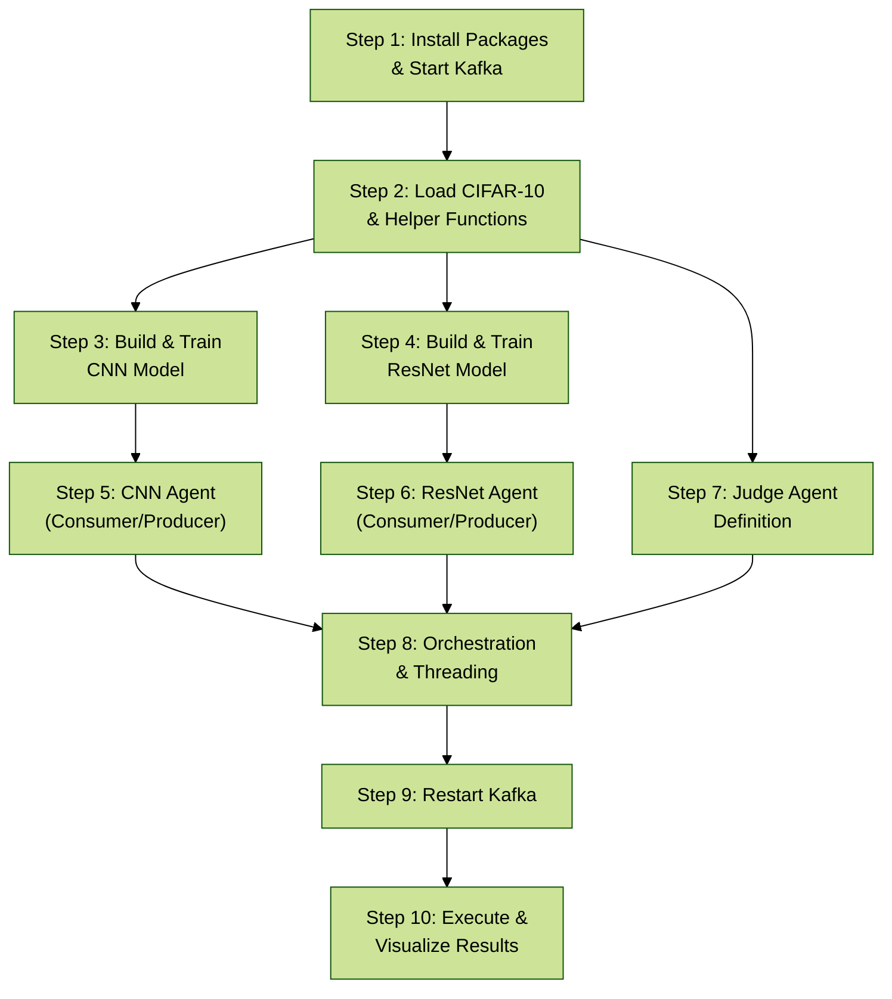
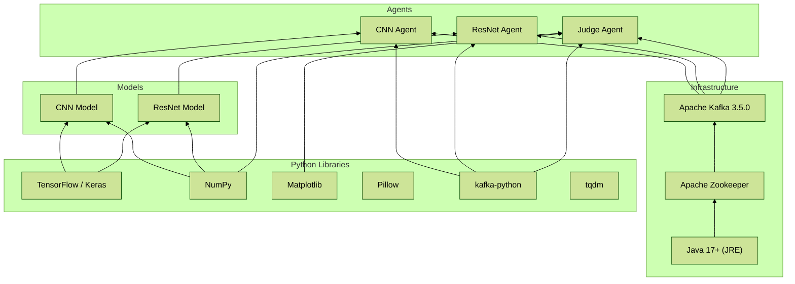
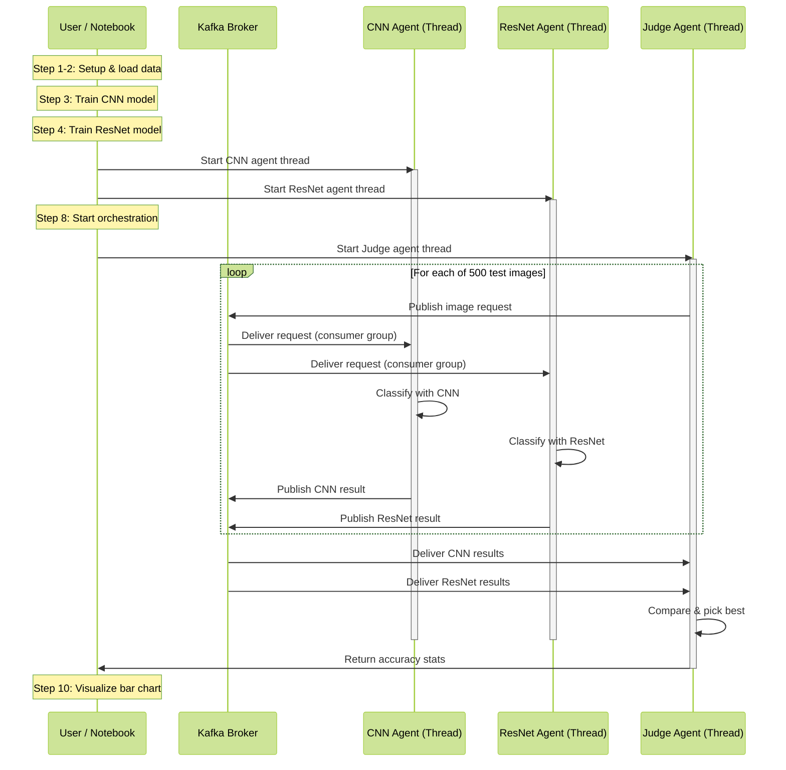
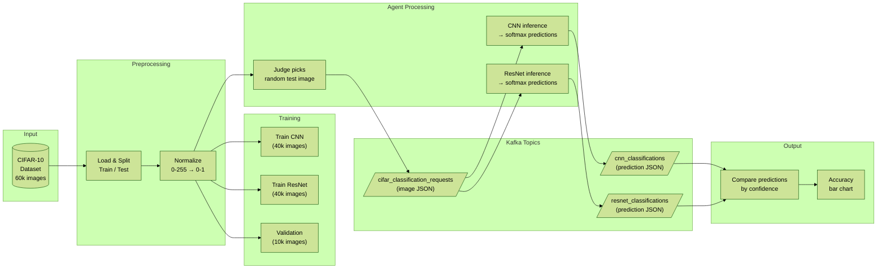
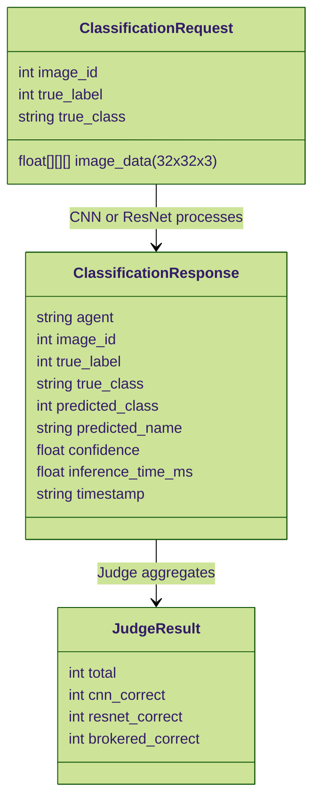

# Agentic AI for Image Classification

A multi-agent system that uses Apache Kafka as a message broker to compare two deep learning models (CNN and ResNet) classifying CIFAR-10 images. A Judge agent orchestrates the comparison and selects the best prediction based on confidence scores.

## Architecture

**Agents:**

- **CNN-CIFAR** -- Custom convolutional neural network with batch normalization and dropout
- **RESNET-CIFAR** -- ResNet-style model with residual (skip) connections
- **Judge** -- Sends test images to both agents via Kafka, collects responses, picks the higher-confidence prediction as the "brokered" result, and visualizes accuracy

## Diagrams

### Notebook Dependency Graph

Shows the dependency chain between the notebook steps -- what must complete before each subsequent step can run.

### Software Dependency Stack

External libraries and services required by the system.

### Process Flow

End-to-end execution sequence from setup through results.

### Data Flow

How image data moves through the system and transforms at each stage.

### Kafka Topic Message Schemas

Structure of the JSON messages passed through Kafka.

## Dataset

[CIFAR-10](https://www.cs.toronto.edu/~krig/cifar.html) -- 60,000 32x32 color images in 10 classes: airplane, automobile, bird, cat, deer, dog, frog, horse, ship, truck.

## Requirements

- Python 3.10+
- TensorFlow / Keras
- Apache Kafka 3.5.0 (requires Java 17+)
- kafka-python
- numpy, matplotlib, pillow, tqdm

## Quick Start

The notebook was originally built for Google Colab. To run on a local or VPS environment, see [RUN_ON_VPS.md](RUN_ON_VPS.md) for full setup instructions covering both CPU-only and GPU configurations.

## Files

| File | Description |
|---|---|
| `image_class.ipynb` | Main notebook -- trains models, runs agents, visualizes results |
| `RUN_ON_VPS.md` | Deployment guide for Ubuntu 24.04 (CPU and GPU) |

## Status

Work in progress -- actively improving and expanding the system.
